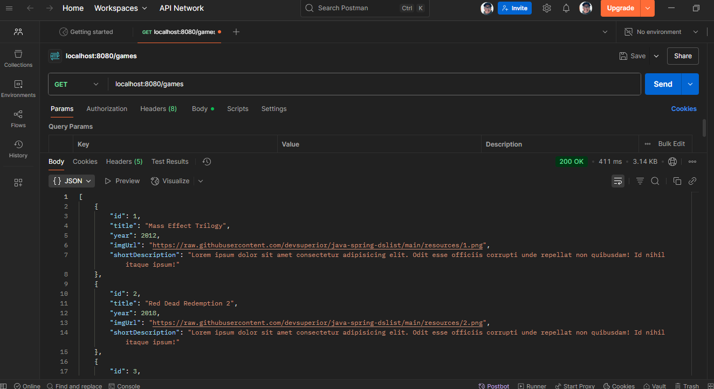

# **Game List** 


# About this project 
This is an API that I developed in a free course I took at DevSuperior where we worked on a back-end in JAVA with SpringBoot, Hibernate, JPA and SQL. It shows a list of Games with some data such as name, year of the game and platform. The difference with this API is that the user can move the game within the list, placing it in a new position. There is exception handling, for example if the user tries to insert the game in a non-existent position within the list. 

# Application layout 

 - Directory structure 
   

 - Class
  

 - Controllers 
  

 - Service
  

 - Exceptions
  

 - Application Run
  

- Postman
  


# Technologies used 

- Java
- SpringBoot
- Hibernate
- JPA
- SQL
- Postgre for profile dev
- H2 for profile test 

# How to run this project

```bash
#clone this repository using ssh for your machine

git clone git@github.com:joao123marcos/backEnd_dsList.git
```
```bash
#Enter in directory dowloaded

cd backEnd_dsList
```
```bash
#Run project maven

mvnw spring-boot:run
```
# Author 
João Marcos dos Santos Pires  

Linkedin: www.linkedin.com/in/joao-marcos-pires-642585155  
Email: joaomarcos.spires@gmail.com